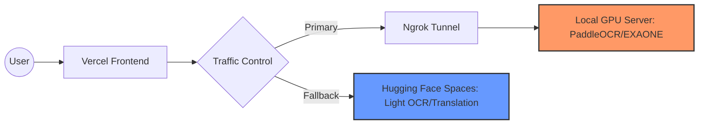
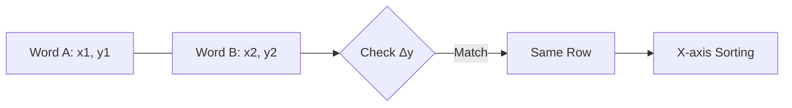

# 🐼 Hanyu-Lens (한어 렌즈) 🔍

> **실시간 AR 기반 중어중문학습 보조 플랫폼** > 고성능 AI 모델을 활용하여 복잡한 레이아웃 속 한자를 정밀하게 분석하고 학습합니다.

---

## 📝 프로젝트 개요 (Project Overview)

---

## 🚀 주요 기능 (Core Features)

### **실시간 AR 번역 (Real-time AR Lens)**
* **카메라 화면**에 글자를 비추는 즉시 병음과 성조를 자막 형태로 표시.
* **자유로운 크롭 박스** 조절로 원하는 영역만 정밀 분석 가능.

### **지능형 텍스트 분석 (Hybrid AI Analysis)**
* **PaddleOCR**: 표, 성분표, 손글씨 등 복잡한 레이아웃 속 한자를 정밀하게 인식.
* **EXAONE (LLM)**: 단순 번역이 아닌 문법적 단위(양사, 보어 등)를 쪼개어 단어장 형태로 풀이.

### **원어민 발음 청취 (AI TTS System)**
* **남성/여성 성별 선택** 기능 및 문장/단어별 개별 청취 지원.
* **edge-tts** 기반의 고품질 자연어 음성 합성.

### **나만의 단어장 (Smart Vocabulary)**
* 분석된 단어를 **클릭 한 번**으로 `localStorage`에 저장 및 관리.
* **회원가입 없이** 즉시 사용 가능한 개인화 학습 환경.

### **설치형 웹 앱 (PWA)**
* 별도의 스토어 방문 없이 홈 화면에 추가하여 진짜 앱처럼 편리하게 사용 가능합니다.
---

## 🛠 기술 스택 (Tech Stack)

### **Frontend**


### **Backend & AI**


### **세부 기술 리스트**

| 구분 | 기술 / 라이브러리 |
| :--- | :--- |
| **Frontend** | React, TypeScript, Tailwind CSS, Vite, Framer Motion |
| **Backend** | Python, FastAPI, Uvicorn |
| **OCR / AI** | PaddleOCR, EXAONE 3.5 (Ollama), Google Translator |
| **NLP** | jieba (형태소 분석), hanja (한국식 독음), pypinyin |
| **Infrastructure** | Vercel, Hugging Face Spaces (Fallback), Ngrok |

---

## 🛡️ 인프라 아키텍처 (Infrastructure Architecture)

무거운 AI 모델의 연산 부하를 해결하고 서비스의 안정성을 확보하기 위해 **하이브리드 서버 구조** 구축.

### **[Hybrid Server Architecture]**

* **🚀 Main Server (Local GPU)**
    * 개발자 로컬 PC의 **GPU 자원**을 직접 활용하여 고성능 AI 연산 수행.
    * 주요 엔진: `PaddleOCR`, `EXAONE 3.5 (via Ollama)`
* **☁️ Fallback Server (Cloud)**
    * 메인 서버 장애 또는 로컬 PC 종료 시, **Hugging Face Spaces** 클라우드 서버로 자동 전환.
    * **24시간 중단 없는** 기본적인 텍스트 분석 및 번역 서비스 보장.
* **🌐 Networking & Security**
    * **Ngrok** 고정 도메인 터널링을 통해 로컬 서버를 보안 프로토콜(`HTTPS`)로 외부 배포 환경과 안정적으로 연결.


> **Architecture Flow:**
> Client (Vercel) ↔️ Ngrok Tunnel ↔️ Local Server (Primary) / Hugging Face (Secondary)

---

## 🛠 기술적 도전 및 해결 (Technical Challenges)

이 프로젝트는 무료 인프라 환경에서 고성능 AI 모델을 안정적으로 서비스하기 위한 다양한 엔지니어링적 고민을 담고 있습니다.

### 1. 수학적 모델을 이용한 레이아웃 복원 알고리즘 설계
* **Problem:** 일반 OCR은 표나 문단의 위치 정보를 무시하고 텍스트를 한 줄로 합쳐버려 원본 레이아웃이 파괴되는 현상 발생.
* **Solution:** PaddleOCR이 반환하는 각 단어의 **2차원 좌표($x, y$)**를 분석하는 알고리즘을 직접 설계. 

#### **[Logic Flow]**

* **Y축 그룹화**: 두 객체의 $y$좌표 차이($\Delta y$)가 글자 높이의 50% 미만이면 동일 행으로 그룹화합니다.

$$\Delta y < \text{Average Height} \times 0.5$$

* **X축 정렬**: 그룹화된 행 내부에서 $x$좌표를 기준으로 정렬하여 인간의 **읽기 순서(Reading Order)**를 완벽히 복원합니다.


### 2. 하이브리드 서버 및 자동 장애 복구(Failover) 시스템 구축
* **Problem:** 로컬 GPU 서버(내 PC)가 꺼지면 서비스가 중단되는 단일 장애점(SPOF) 발생.
* **Solution:** **Ngrok** 기반의 메인 서버와 **Hugging Face** 클라우드 기반의 비상 서버를 이중화 처리. 
    * 프론트엔드에서 메인 서버 응답이 없으면 자동으로 클라우드 API로 요청을 우회(**Fallback**)하여 24시간 가용성 확보.

### 3. 라이브러리 의존성 및 버전 지옥(Dependency Hell) 해결
* **Problem:** 최신 `NumPy 2.0`, `OpenCV 4.13`, `PaddlePaddle 3.0` 간의 ABI 호환성 에러 및 PIR 엔진 버그 발생.
* **Solution:** 무조건 최신 버전을 쓰기보다 서비스 안정성을 최우선으로 고려. 
    * 직접 테스트를 통해 검증된 **안정화 버전 조합(`Paddle 2.6.2` + `Numpy 1.26.4` + `OpenCV 4.6.0`)**으로 최적의 빌드 환경 구축.

### 4. 모바일 브라우저 오디오 보안 정책(Autoplay Policy) 우회
* **Problem:** 비동기 API 요청 후 실행되는 `Audio.play()`가 브라우저에 의해 '사용자 의도 없음'으로 간주되어 차단됨.
* **Solution:** **선제적 권한 확보 전략** 사용. 
    * 버튼 클릭 이벤트 즉시 빈 오디오 객체를 먼저 실행하여 브라우저의 재생 권한을 선점.
    * 서버 데이터(TTS)가 도착하면 `src`만 교체하여 끊김 없는 사용자 경험 제공.
 
---

### 📸 스크린샷 (Screenshots)
(여기에 시작 화면, 분석 결과, 단어장, 실시간 모드 사진들을 예쁘게 넣어주세요!)

---

## 🐼 마스코트 & 디자인 (Mascot & Design)

프로젝트의 시각적 정체성과 사용자 경험을 결정하는 디자인 요소입니다.

### **[Design Concept]**
* **Tone & Manner**: 깨끗하고 신뢰감 있는 학습 환경을 상징하는 **Jade (비취색)** 컬러를 메인 스택으로 사용.
* **UI/UX**: 미니멀한 레이아웃에 **Framer Motion**을 결합하여 부드러운 인터랙션 제공.

### **[Mascot & Splash Screen]**
* **Concept**: 판다가 돋보기로 중국어를 탐구하는 생동감 넘치는 캐릭터 디자인.
* **Animation**: 앱 시작 시 **Splash Screen**을 통해 학습의 즐거움을 시각적으로 표현.

>   
> *판다가 돋보기로 중국어를 탐구하는 애니메이션 스플래시 화면 예시*

---

### 🏃 실행 방법 (Getting Started)
### 1. Backend (Python)
```bash
# 가상환경 활성화 후 라이브러리 설치
cd backend
pip install -r requirements.txt

# 로컬 AI 서버 실행 (Ollama 필수)
ollama run exaone3.5:7.8b

# 백엔드 API 실행
uvicorn main:app --reload --port 8000

# 외부 노출을 위한 Ngrok 실행
ngrok http --domain=your-domain.ngrok-free.dev 8000
```
### 2. Frontend (React)
```bash
cd frontend
npm install

# .env 파일 생성 및 VITE_API_URL 설정 후 실행
npm run dev
```


